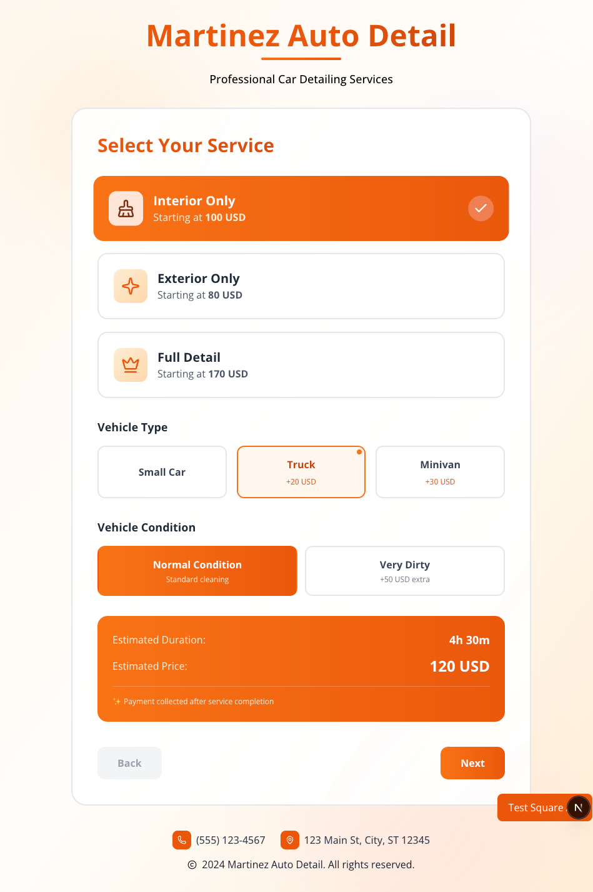
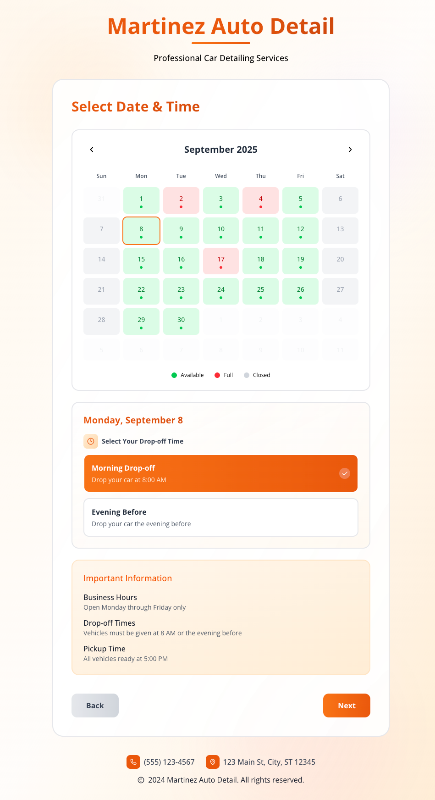
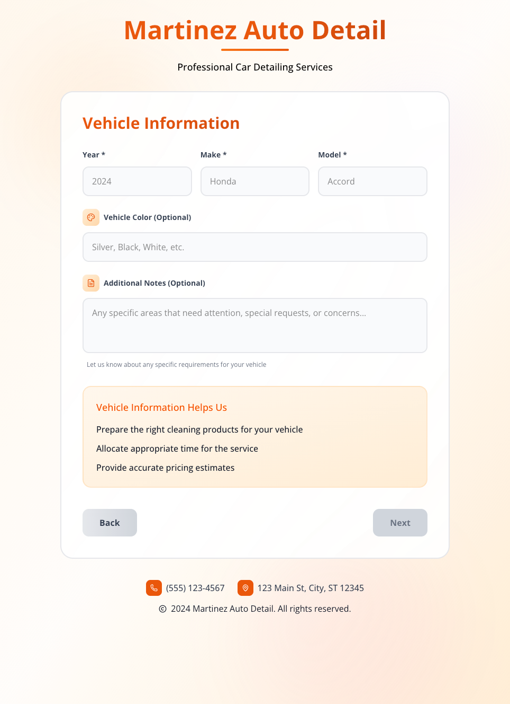
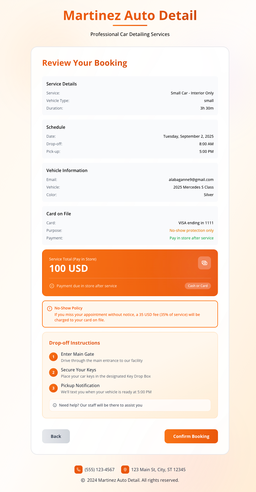
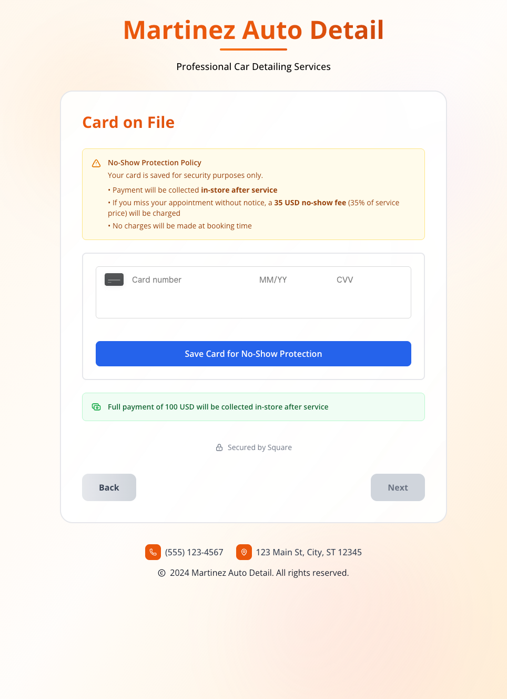
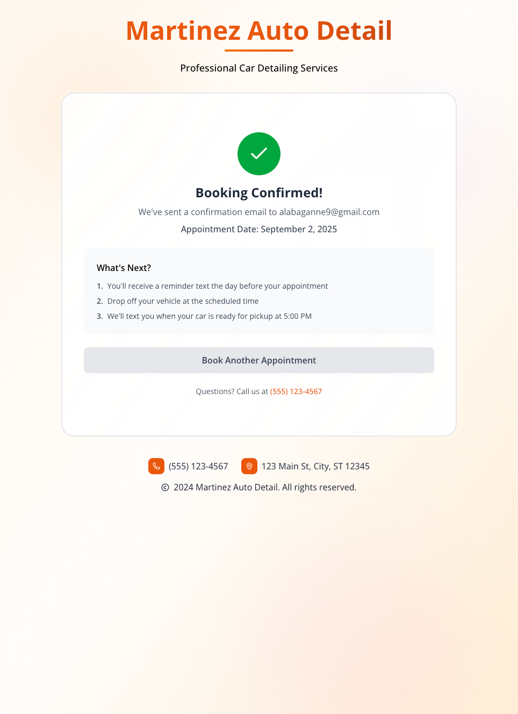
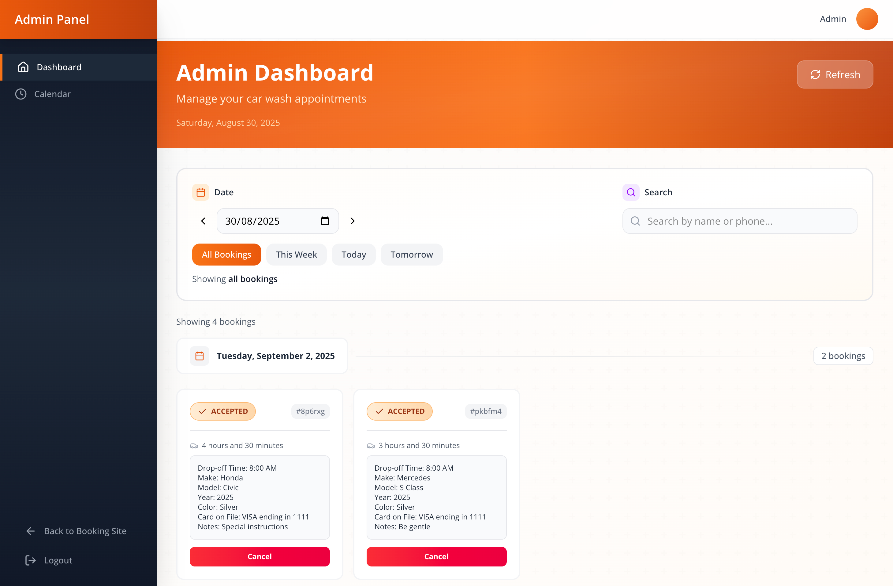
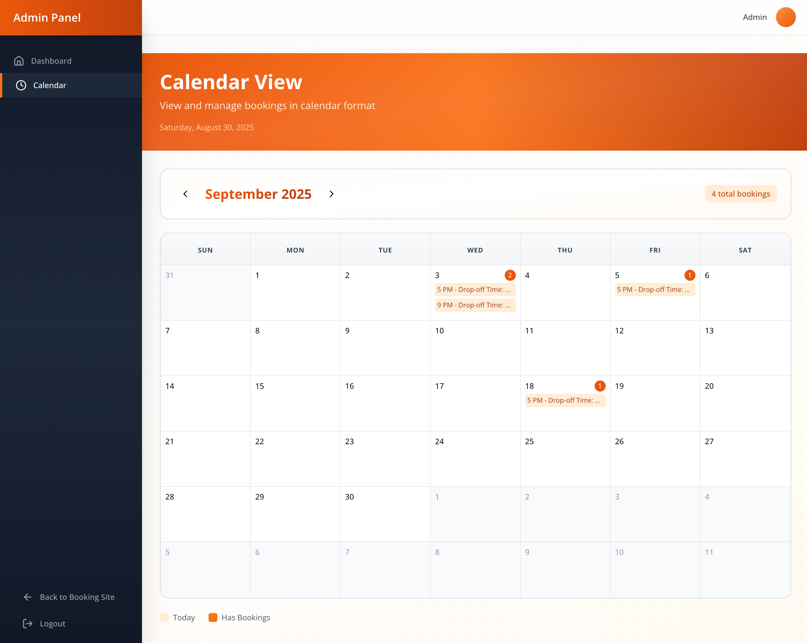
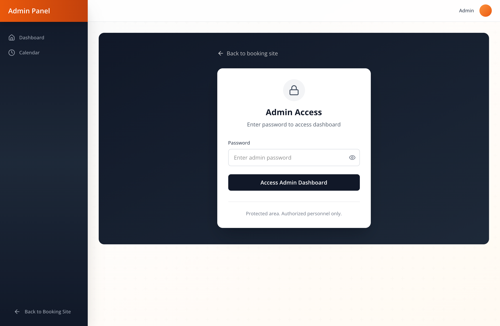

# Car Wash Appointment Booking System

A modern, responsive web application for Martinez Auto Detail that allows customers to book car detailing appointments online. Built with Next.js, React, and Tailwind CSS.

## Features

- **Multi-step Booking Form**: Intuitive 4-step process for booking appointments
- **Service Selection**: Choose between Interior Only, Exterior Only, or Full Detail services
- **Dynamic Pricing**: Real-time price calculation based on:
  - Service type
  - Vehicle size (Small Car, Truck, Minivan)
  - Vehicle condition (Normal or Very Dirty)
- **Flexible Scheduling**: 
  - Date picker with weekday-only selection
  - Same-day or evening-before drop-off options
  - Fixed 5:00 PM pickup time
- **Vehicle Information**: Capture customer and vehicle details
- **Booking Review**: Comprehensive summary before confirmation
- **Secure Payment**: Charge customers during booking with Square and send instant receipts
- **Admin Dashboard**: Manage bookings, view calendar, and track appointments
- **Responsive Design**: Works seamlessly on desktop and mobile devices

## Tech Stack

- **Next.js 15** - Full-stack React framework
- **React 19** - UI library
- **Tailwind CSS v4** - Utility-first CSS framework
- **Lucide React** - Icon library
- **Square API** - Payment processing and appointment scheduling

## Preview

### Booking Flow

| Service Selection | Schedule Selection | Vehicle Information |
|:-----------------:|:------------------:|:-------------------:|
|  |  |  |

| Review & Confirm | Payment | Confirmation |
|:----------------:|:------------:|:------------:|
|  |  |  |

### Admin Dashboard







## Getting Started

### Prerequisites

- Node.js 18+ 
- npm or yarn

### Installation

1. Clone the repository:
```bash
git clone git@github.com:alabaganne/car-wash-appointments.git
cd car-wash-appointments
```

2. Install dependencies:
```bash
npm install
```

3. Set up Square Sandbox account:
   - Create a free account at [Square Developer](https://developer.squareup.com)
   - Navigate to your Sandbox Dashboard
   - Enable **Square Appointments** in the Sandbox Dashboard

4. Configure environment variables:
   - Copy `.env.example` to `.env.local`
   - Add your Square credentials:
```bash
cp .env.example .env.local
```
   - Update `.env.local` with:
     - `SQUARE_ACCESS_TOKEN`: Your Sandbox access token from Square Dashboard
     - `NEXT_PUBLIC_SQUARE_APPLICATION_ID`: Your Sandbox application ID
     - `SQUARE_ENVIRONMENT`: Set to `sandbox` for development
     - `ADMIN_PASSWORD`: Set your admin dashboard password

5. Initialize Square catalog and team (Required):
```bash
# Create service catalog items
npm run create:catalog

# Create team members
npm run create:team
```

6. Configure team members in Square Dashboard:
   - Go to your Square Sandbox Dashboard
   - Navigate to Staff > Team > Team Members
   - Make your team members **bookable** for appointments

7. Start the development server:
```bash
npm run dev
```

8. Open your browser and navigate to:
```
http://localhost:3000
```

### Available Scripts

#### Development & Build
- `npm run dev` - Start development server
- `npm run build` - Build for production
- `npm run start` - Start production server
- `npm run lint` - Run ESLint

#### Square API Management
- `npm run create:catalog` - Create catalog items in Square
- `npm run create:team` - Create team members in Square
- `npm run view:catalog` - View current catalog items
- `npm run view:team` - View current team members
- `npm run view:bookings` - View all bookings
- `npm run seed:bookings` - Create sample bookings (development)

